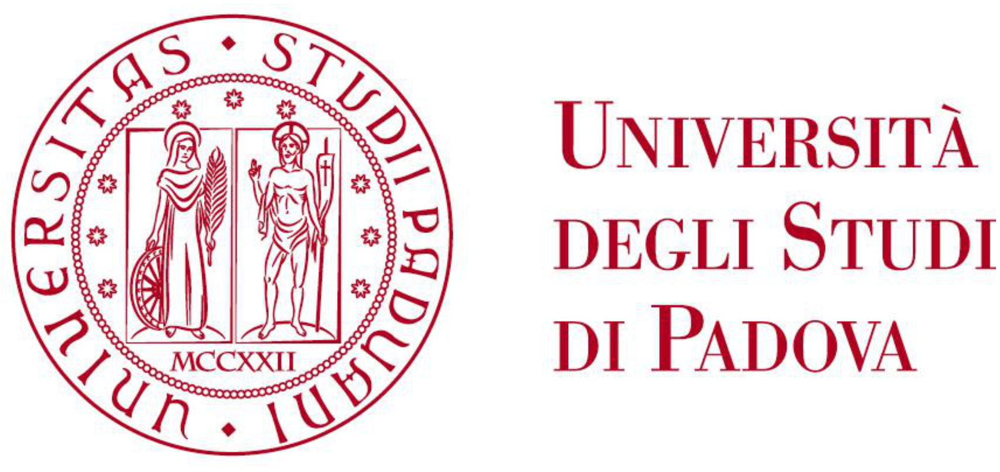
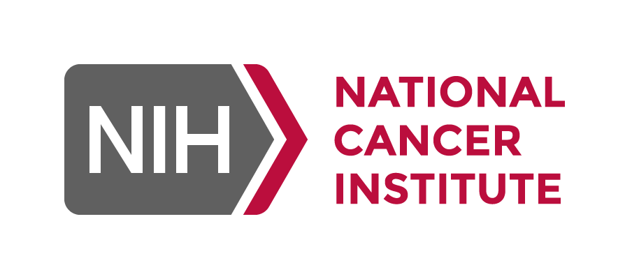

&nbsp;   &nbsp;   &nbsp;

I am an Assistant Professor (Tenure-Track Researcher) of Statistics at the Department of Statistical Sciences of the University of Padova (Italy). 
My research interests are prevalently focused on developing clustering methods based on probability distributions (model-based clustering) both in the Frequentist and in the Bayesian paradigms, with particular emphasis to the applications in genomics and astronomy.

&nbsp; 

**Education**

- **(2016-2020)** Ph.D in Statistical Sciences, University of Padova (Italy)

- **(2014-2016)** MSc in Statistical Sciences, University of Padova (Italy)

- **(2011-2014)** BSc in Statistics and Information Management, University of Milan-Bicocca (Italy)

&nbsp; 

**Visiting**

- **(07/2022-08/2022)** Visiting Post-doc, Johns Hopkins Bloomberg School of Public Health, Baltimore (USA), [Prof. Stefanie Hicks](https://www.stephaniehicks.com)

- **(04/2018-10/2018)** Visiting research scholar, Imperial College London, London (UK), [Prof. David A. van Dyk](https://www.ma.imperial.ac.uk/~dvandyk/index.php)

&nbsp; 

**Membership**

- International Society for Bayesian Analysis (ISBA)

- Italian Statistical Society (SIS)

- International [CHASC](International CHASC Astro-Statistics Collaboration) Astro-Statistics Collaboration 
<!---
&nbsp;   &nbsp;

&nbsp;&nbsp;&nbsp;&nbsp;&nbsp;&nbsp;&nbsp;&nbsp;&nbsp;&nbsp;
Sponsored by: 

--->